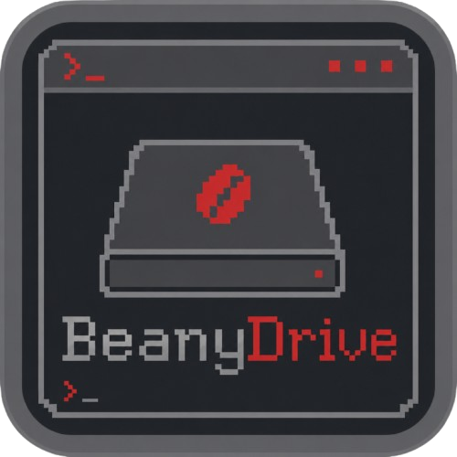

<p align="center">
  
</p>

<h1 align="center">BeanyDrive</h1>

<p align="center">
  A terminal-styled desktop client that uses a Discord text channel as personal cloud storage — keyboard-driven, themeable, built with Electron.
</p>

<p align="center">
  <a href="#features">Features</a> ·
  <a href="#getting-started">Installation</a> ·
  <a href="#keyboard-shortcuts">Shortcuts</a> ·
  <a href="#notes">Notes</a>
</p>

---

BeanyDrive is GreenyBeany's Electron sibling to
[DiscordCloudStorage](https://github.com/Gymoblig/DiscordCloudStorage) — same
idea (a Discord bot + channel become your storage backend: large files are
split into chunks, uploaded as attachments, and reassembled on download; a
pinned JSON message in the channel is the index, so nothing lives only on
your machine), rebuilt as a proper desktop app with the same terminal-styled
UI language as [BeanyBox](https://github.com/Gymoblig/BeanyBox).

Unlike the original Python bot, BeanyDrive talks to Discord purely over REST
(no gateway/WebSocket connection) — every operation it needs (send a
message + attachment, list pins, fetch/delete a message) has a REST
endpoint, and REST message fetches always return full content regardless of
the privileged **Message Content Intent**. So there's one less toggle to
flip when creating your bot.

## Features

- **Discord-backed storage** — files are chunked to fit your server's
  upload limit, sent as attachments, and reassembled on download; metadata
  (names, paths, chunk message IDs) lives as a pinned JSON attachment in the
  channel itself
- **Folders** — create, navigate via breadcrumb or the sidebar, delete
- **Star, tag, and Trash** — star files for quick access, tag them
  (`design`/`work`/`personal`), soft-delete to Trash and restore, or
  **Empty Trash** to permanently remove chunks from Discord (confirmed via
  an in-app dialog with an optional "don't ask again")
- **Search & sort** — filter by name or tag across the current folder, sort
  by date/name/size, toggle list/grid view and comfortable/compact density
- **Drag and drop** — drop files or whole folders anywhere on the window to
  upload (folder structure is preserved); large uploads that hit Discord's
  size limit automatically retry at a smaller chunk size
- **Keyboard-driven** — `j`/`k` to move, `Enter` to open a folder, `u`
  upload, `n` new folder, `r` rename, `Space` star, `d` trash, `x` restore,
  `,` settings
- **Appearance settings** — dark/light/system theme, 8 accent colors,
  comfortable/compact density, all live-applied with no restart
- Bot token stored encrypted at rest via Electron's `safeStorage` —
  Windows DPAPI, macOS Keychain, or the Linux Secret Service if one's
  running; falls back to plain storage otherwise, same as any other
  Electron app

## Getting started

### 1. Create a Discord bot (one-time, ~5 minutes)

1. Go to the [Discord Developer Portal](https://discord.com/developers/applications),
   **New Application**, name it (e.g. `BeanyDrive`).
2. Open the **Bot** tab → **Reset Token** → copy the token. You'll paste
   this into BeanyDrive's Settings panel, not a config file.
3. Under **OAuth2 → URL Generator**: scope **bot**, permissions **Send
   Messages**, **Read Message History**, **Manage Messages**, **Attach
   Files**. Open the generated URL and add the bot to your server.
4. In Discord, enable **Settings → Advanced → Developer Mode**, then
   right-click the text channel you want to use as storage and **Copy
   Channel ID**.

### 2. Install & run

```sh
npm install
npm start
```

Open **Settings** (the `, settings` link, or press `,`), paste the bot
token and channel ID, and click **Save & connect**. Use **Test connection**
first if you just want to verify the token/channel without saving yet.

### 3. Build a standalone app (optional)

```sh
npm run dist
```

On Windows this produces a portable `.exe` and an NSIS installer in `dist/`.
On Linux it produces an `.AppImage` — make it executable (`chmod +x
BeanyDrive-*.AppImage`) and run it directly.

## Keyboard shortcuts

| Key       | Action                              |
| --------- | ------------------------------------ |
| `j` / `k` | Move selection down / up             |
| `Enter`   | Open selected folder                 |
| `u`       | Upload files                         |
| `n`       | New folder                           |
| `r`       | Rename selected file                 |
| `Space`   | Star / unstar selected file          |
| `d`       | Move selected file to Trash          |
| `x`       | Restore selected file (in Trash)     |
| `,`       | Settings                             |
| `Esc`     | Close settings / dialog / clear search |

## Notes

- **Chunk size**: configurable in Settings (default 25 MB), but the
  effective chunk size is always capped by your Discord server's real
  upload limit (based on its boost tier), the same auto-detection the
  original bot did. If Discord ever rejects a chunk as too large mid-upload,
  BeanyDrive halves the chunk size and retries automatically.
- **Folders**: virtual, same as the original — they exist as path prefixes
  on files plus an explicit folder list for empty directories.
- **Trash vs. permanent delete**: moving a file to Trash only flips a flag
  in the metadata index — its chunks stay in the channel until you
  **Empty Trash**, which is the one action that actually deletes messages
  from Discord.
- **Copy Link**: copies the Discord CDN URL of a file's first chunk. Works
  cleanly for small (single-chunk) files; for anything split into multiple
  chunks it's a partial link, and either way Discord CDN links can expire.
- **Tags**: a fixed three-tag palette (`design`/`work`/`personal`), added
  or removed per file from the detail panel.
- **Token storage**: encrypted the same way as BeanyBox's mail tokens and
  lives only in the main process — the renderer never sees it, only
  whether one's saved.
- **Icons**: folder and file-type icons are [Font Awesome Free](https://fontawesome.com)
  (Solid), embedded inline as SVG so there's no runtime font/CDN dependency.
  Icons are licensed [CC BY 4.0](https://creativecommons.org/licenses/by/4.0/).
