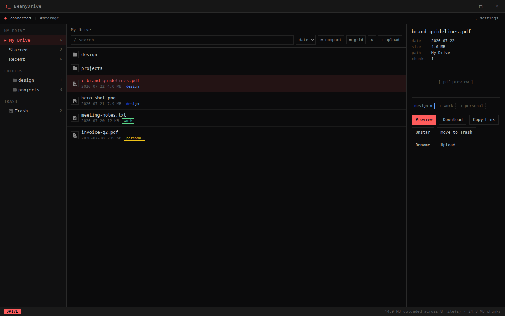
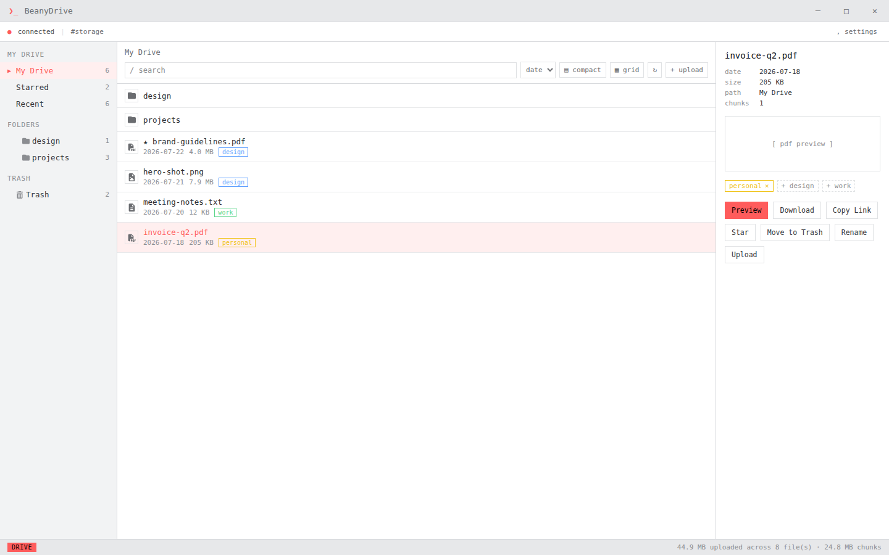
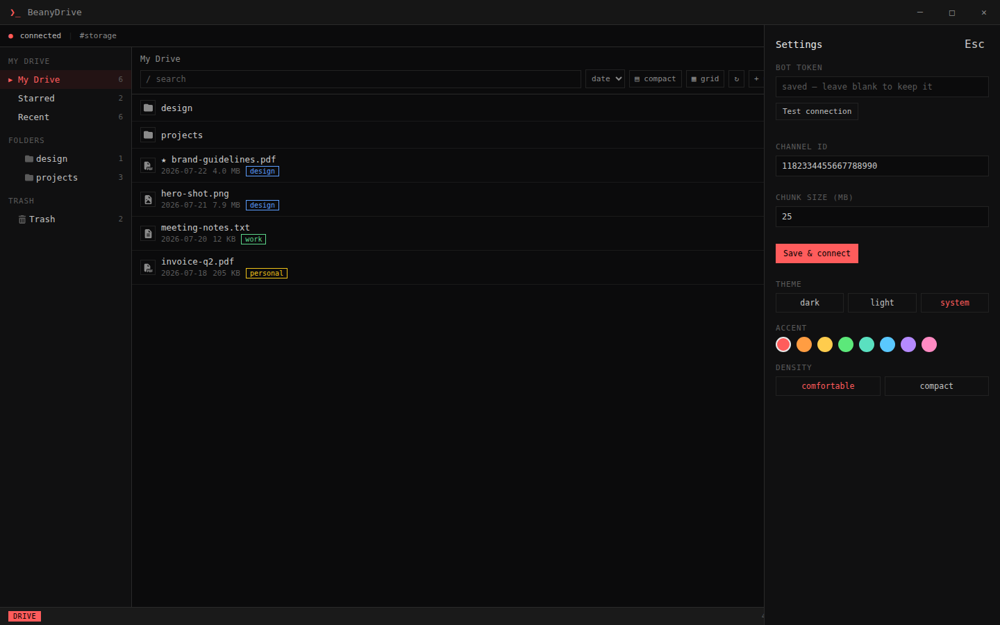
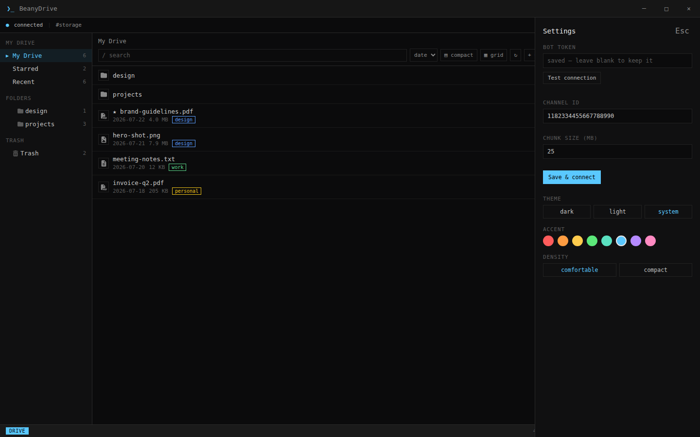
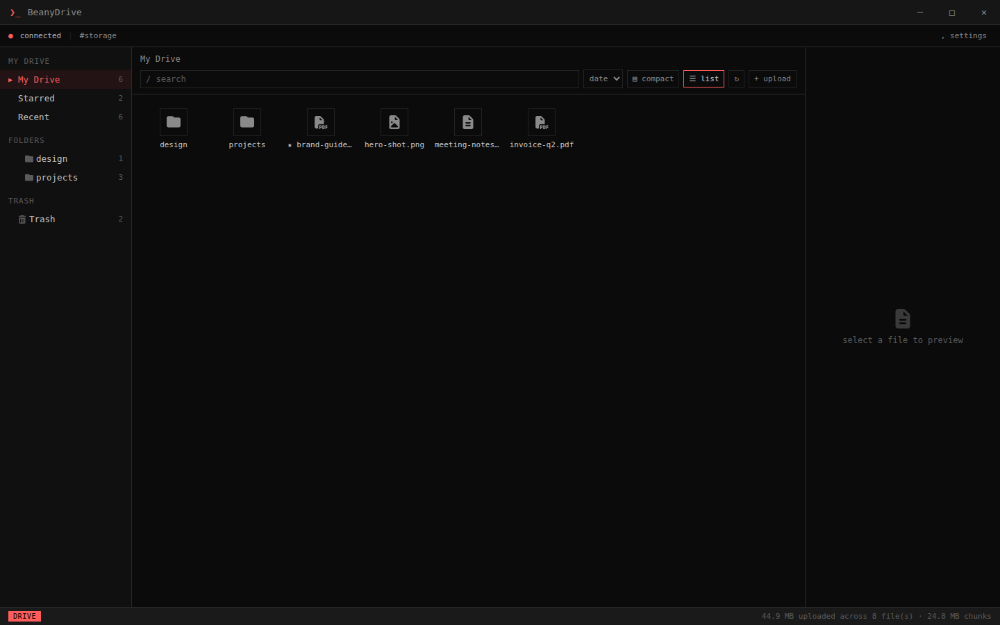
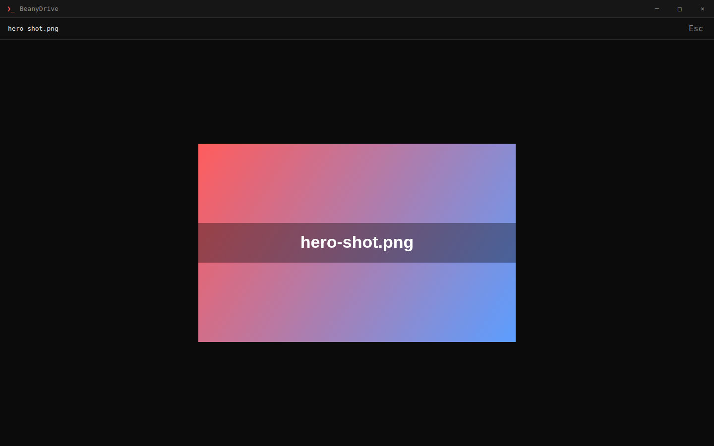
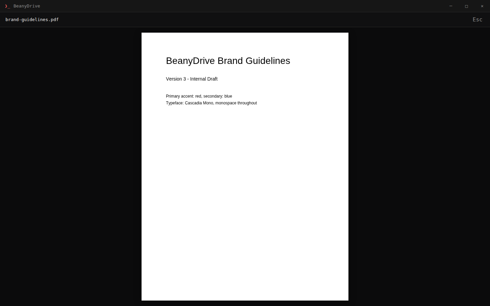
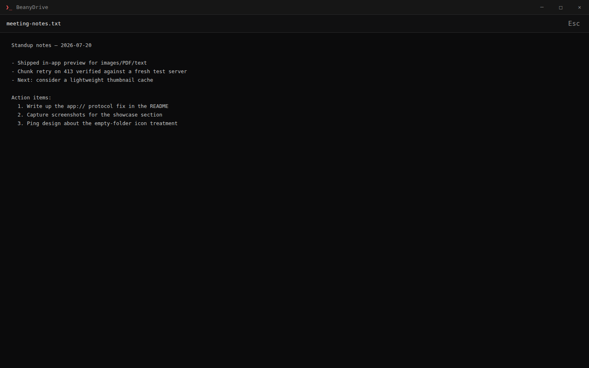

<p align="center">
  
</p>

<h1 align="center">BeanyDrive</h1>

<p align="center">
  A terminal-styled desktop client that uses a Discord text channel as personal cloud storage — keyboard-driven, themeable, built with Electron.
</p>

<p align="center">
  <a href="#showcase">Showcase</a> ·
  <a href="#features">Features</a> ·
  <a href="#getting-started">Installation</a> ·
  <a href="#keyboard-shortcuts">Shortcuts</a> ·
  <a href="#notes">Notes</a>
</p>

<p align="center">
  <a href="https://github.com/Greenythebeany/BeanyDrive/releases">
    
  </a>
</p>

---

BeanyDrive is GreenyBeany's Electron sibling to
[DiscordCloudStorage](https://github.com/Greenythebeany/DiscordCloudStorage) — same
idea (a Discord bot + channel become your storage backend: large files are
split into chunks, uploaded as attachments, and reassembled on download; a
pinned JSON message in the channel is the index, so nothing lives only on
your machine), rebuilt as a proper desktop app with the same terminal-styled
UI language as [BeanyBox](https://github.com/Greenythebeany/BeanyBox).

Unlike the original Python bot, BeanyDrive talks to Discord purely over REST
(no gateway/WebSocket connection) — every operation it needs (send a
message + attachment, list pins, fetch/delete a message) has a REST
endpoint, and REST message fetches always return full content regardless of
the privileged **Message Content Intent**. So there's one less toggle to
flip when creating your bot.

## Showcase

<p align="center">
  
</p>

<p align="center"><i>
  Folders, tags, and a selected file's detail panel — the same terminal
  chrome, titlebar, and settings pattern as BeanyBox.
</i></p>

### Light & dark

Pick a theme in Settings (`,`) — Dark, Light, or System (follows your OS and
switches live if it changes):

<table>
<tr>
<td width="50%"></td>
<td width="50%"></td>
</tr>
<tr>
<td align="center">Light</td>
<td align="center">Dark</td>
</tr>
</table>

### Every color, grid or list

Eight accent colors, applied live everywhere — active rows, borders,
buttons, the mode badge — plus a grid view alongside the default list:

<table>
<tr>
<td width="50%"></td>
<td width="50%"></td>
</tr>
</table>

<p align="center">
  
</p>

### In-app preview

Images, PDFs (rendered page-by-page via pdf.js), and text/code open full-window
without a Save As dialog:

<table>
<tr>
<td width="33%"></td>
<td width="33%"></td>
<td width="33%"></td>
</tr>
<tr>
<td align="center">Image</td>
<td align="center">PDF</td>
<td align="center">Text</td>
</tr>
</table>

## Features

- **Discord-backed storage** — files are chunked to fit your server's
  upload limit, sent as attachments, and reassembled on download; metadata
  (names, paths, chunk message IDs) lives as a pinned JSON attachment in the
  channel itself
- **Folders** — create, navigate via breadcrumb or the sidebar, delete
- **Star, tag, and Trash** — star files for quick access, tag them
  (`design`/`work`/`personal`), soft-delete to Trash and restore, or
  **Empty Trash** to permanently remove chunks from Discord (confirmed via
  an in-app dialog with an optional "don't ask again")
- **Search & sort** — filter by name or tag across the current folder, sort
  by date/name/size, toggle list/grid view and comfortable/compact density
- **Drag and drop** — drop files or whole folders anywhere on the window to
  upload (folder structure is preserved); large uploads that hit Discord's
  size limit automatically retry at a smaller chunk size
- **Uploads built for big files** — chunks upload several at a time
  (configurable, default 4), progress rows show transfer speed and time
  remaining, and each row can be **paused**, **resumed**, **retried** after a
  failure, or canceled. Pausing or failing keeps the chunks that already
  landed, so picking the upload back up re-sends only what's missing
- **Drag out to the desktop** — drag a file from the list straight into
  Explorer or Finder. Files live on Discord, so the first drag fetches a local
  copy (with progress) and the drag itself works from then on; a ⇱ next to the
  name marks the ones that are ready
- **In-app preview** — images, PDFs, video, audio, and text/code files open
  in a full-window preview (`Preview` button, or `p`) without a Save As
  dialog; the file is reassembled in memory over Discord's REST API and
  handed straight to the renderer, capped at 500 MB
- **Keyboard-driven** — `j`/`k` to move, `Enter` to open a folder, `u`
  upload, `n` new folder, `r` rename, `p` preview, `Space` star, `d` trash,
  `x` restore, `,` settings
- **Appearance settings** — dark/light/system theme, 8 accent colors,
  comfortable/compact density, all live-applied with no restart
- Bot token stored encrypted at rest via Electron's `safeStorage` —
  Windows DPAPI, macOS Keychain, or the Linux Secret Service if one's
  running; falls back to plain storage otherwise, same as any other
  Electron app

## Getting started

### 1. Create a Discord bot (one-time, ~5 minutes)

1. Go to the [Discord Developer Portal](https://discord.com/developers/applications),
   **New Application**, name it (e.g. `BeanyDrive`).
2. Open the **Bot** tab → **Reset Token** → copy the token. You'll paste
   this into BeanyDrive's Settings panel, not a config file.
3. Under **OAuth2 → URL Generator**: scope **bot**, permissions **Send
   Messages**, **Read Message History**, **Manage Messages**, **Attach
   Files**. Open the generated URL and add the bot to your server.
4. In Discord, enable **Settings → Advanced → Developer Mode**, then
   right-click the text channel you want to use as storage and **Copy
   Channel ID**.

### 2. Install & run

**Option A: Download (recommended)** — grab the latest portable `.exe` or
NSIS installer (Windows) or `.AppImage` (Linux) from the
[Releases page](https://github.com/Greenythebeany/BeanyDrive/releases). No
Node/npm needed; nothing is bundled inside it except the app itself — you
still bring your own bot token and channel ID from the step above, entered
in Settings on first launch.

> **Windows will show a blue "Windows protected your PC" SmartScreen
> warning the first time you run it.** That's expected for any small,
> unsigned app (a code-signing certificate costs money neither of us has
> spent) — it's not a virus detection. Click **More info**, then **Run
> anyway**.

**Option B: Run from source**

```sh
npm install
npm start
```

Either way: open **Settings** (the `, settings` link, or press `,`), paste
the bot token and channel ID, and click **Save & connect**. Use **Test
connection** first if you just want to verify the token/channel without
saving yet.

### 3. Build a standalone app (optional)

```sh
npm run dist
```

On Windows this produces a portable `.exe` and an NSIS installer in `dist/`.
On Linux it produces an `.AppImage` — make it executable (`chmod +x
BeanyDrive-*.AppImage`) and run it directly.

## Keyboard shortcuts

| Key       | Action                              |
| --------- | ------------------------------------ |
| `j` / `k` | Move selection down / up             |
| `Enter`   | Open selected folder                 |
| `u`       | Upload files                         |
| `n`       | New folder                           |
| `r`       | Rename selected file                 |
| `p`       | Preview selected file                |
| `Space`   | Star / unstar selected file          |
| `d`       | Move selected file to Trash          |
| `x`       | Restore selected file (in Trash)     |
| `,`       | Settings                             |
| `Esc`     | Close settings / dialog / clear search / close preview |
| `←` / `→` | Previous / next page (PDF preview open) |

## Upload speed

A file is uploaded as a series of chunks, each one a separate Discord
message with an attachment. Two settings control how fast that goes, and
only one of them is usually worth changing.

### Parallel chunk uploads (default 4)

How many chunks are in the air at the same time. Uploading them one after
another leaves the connection idle between requests, so sending several at
once is a genuine speed-up — that part is real and it's on by default.

Raising it past 4 mostly isn't, for two reasons:

- **Discord's rate limit.** A bot may create roughly **5 messages per 5
  seconds per channel**. That's about one chunk per second no matter how
  many workers you run — call it ~10 MB/s with 10 MB chunks. Extra workers
  past that don't upload anything, they just sit waiting out `429`
  responses. BeanyDrive honors the `retry_after` Discord sends back, so
  nothing breaks; it simply doesn't get faster.
- **Your upload bandwidth.** ~10 MB/s is about **80 Mbps of upstream**.
  Most home connections are well below that, which means the rate limit was
  never your ceiling — your uplink was, and no amount of parallelism moves
  it.

Set it to **1** if your connection is unstable and you'd rather not have
several large POSTs competing; set it higher than 4 only if you're on a
genuinely fast uplink and want to squeeze the rate limit.

### Chunk size (default 10 MB) — the setting that actually matters

10 MB is Discord's per-attachment limit for a **non-boosted** server. Boost
the server and that limit rises, which is the one change that moves the
ceiling instead of nudging it:

| Server boost level | Max attachment | Chunks for a 4 GB ISO |
| ------------------ | -------------- | --------------------- |
| None / Level 1     | 10 MB          | ~410                  |
| Level 2            | 50 MB          | ~82                   |
| Level 3            | 100 MB         | ~41                   |

Fewer, larger chunks means fewer messages, which means the 5-per-5-seconds
limit stops binding entirely. BeanyDrive detects your server's tier on
connect and caps the chunk size to whatever it actually allows, so raising
this above your server's limit is harmless — it just gets clamped back
down. If your server is boosted, raise it; that's where the real gain is.

## Notes

- **Chunk size**: configurable in Settings (default 10 MB), but the
  effective chunk size is always capped by your Discord server's real
  upload limit (based on its boost tier), the same auto-detection the
  original bot did. If Discord ever rejects a chunk as too large mid-upload,
  BeanyDrive halves the chunk size and retries automatically.
- **Parallel uploads**: how many chunks are sent at once is configurable in
  Settings (default 4, max 8) — see [Upload speed](#upload-speed) for what to
  actually set it to.
- **Pause, resume, retry, cancel**: every progress row carries controls, and
  the difference between them is what happens to the chunks already uploaded.
  **Pause** and **failure** keep them, so resuming or retrying re-sends only
  what's missing. **Cancel** deletes them — including when you dismiss a
  paused or failed row, which is the same thing as giving up on it. A paused
  upload survives as long as the app is open; close the app and it becomes a
  resume record like any other.
- **Resuming**: the chunks that made it are recorded in `uploads-resume.json`
  beside the config. Re-uploading the same file to the same folder picks up
  from there, whether it stopped from a pause, a crash, or a network drop.
  Editing the file invalidates the record — resuming onto changed bytes would
  produce a corrupt file — and records nobody resumes within a week are swept
  on connect, their chunks deleted.
- **Speed and ETA**: measured over a rolling 15-second window of chunk
  completions, so the number reacts to your connection actually changing
  rather than averaging the whole transfer. Folder uploads show a plain
  percentage — their progress is counted in files, not bytes.
- **Folders**: virtual, same as the original — they exist as path prefixes
  on files plus an explicit folder list for empty directories.
- **Trash vs. permanent delete**: moving a file to Trash only flips a flag
  in the metadata index — its chunks stay in the channel until you
  **Empty Trash**, which is the one action that actually deletes messages
  from Discord. That's one DELETE per chunk and can run for minutes on a full
  Trash, so it reports progress as a row in the list rather than appearing to
  hang. The metadata index is rewritten once at the end, so quitting midway
  leaves the already-deleted files still listed — emptying again clears them.
- **Drag out**: an OS drag has to hand over a file that already exists on
  disk, and these live on Discord — so dragging a file that isn't cached yet
  starts the download instead of the drag, and you drag again once it's ready
  (a ⇱ marks cached files). Copies live in `drag-cache` beside the config,
  capped at 2 GB and 7 days, oldest evicted first. They're a convenience, not
  data: deleting the folder costs nothing but a re-download.
- **Copy Link**: copies the Discord CDN URL of a file's first chunk. Works
  cleanly for small (single-chunk) files; for anything split into multiple
  chunks it's a partial link, and either way Discord CDN links can expire.
- **Tags**: a fixed three-tag palette (`design`/`work`/`personal`), added
  or removed per file from the detail panel.
- **Token storage**: encrypted the same way as BeanyBox's mail tokens and
  lives only in the main process — the renderer never sees it, only
  whether one's saved.
- **Icons**: folder and file-type icons are [Font Awesome Free](https://fontawesome.com)
  (Solid), embedded inline as SVG so there's no runtime font/CDN dependency.
  Icons are licensed [CC BY 4.0](https://creativecommons.org/licenses/by/4.0/).
- **Preview**: only categories the app knows how to render get a `Preview`
  button — images, PDF (via a vendored [pdf.js](https://mozilla.github.io/pdf.js/)
  build, [Apache-2.0](https://www.apache.org/licenses/LICENSE-2.0)), video,
  audio, and text/code. Office docs, spreadsheets, and archives still only
  offer Download. Anything over 50 MB is rejected with a message telling
  you to download instead — previewing still means pulling every chunk over
  the network first, same as a download, just held in memory instead of
  written to disk.
- **Why `app://` instead of loading `index.html` straight off disk**:
  Chromium treats plain `file://` pages as an opaque origin, which silently
  breaks ES module workers — exactly what the PDF preview needs. BeanyDrive
  registers a proper `app://` scheme (Electron's documented fix for this)
  and serves the `renderer/` folder through it instead.
